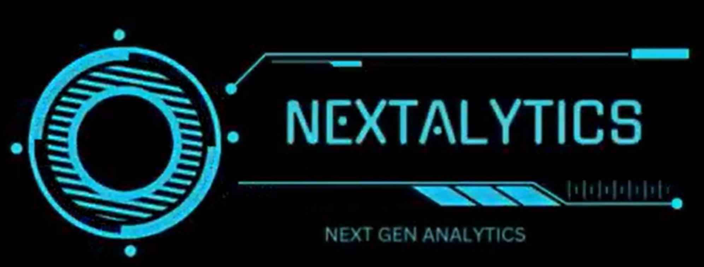

#  Next Generation Analytics Dashboard

Welcome to the **Next Generation Analytics** dashboard — an interactive, user-friendly platform for biomedical data visualization, machine learning, and medical image analysis. This tool is built using **Python**, **Streamlit**, **scikit-learn**, **Plotly**, and **SimpleITK**, and is designed for both clinical researchers and data scientists.

---

## 🚀 Features

- 📁 Upload and preview biomedical datasets (.csv, .xlsx, etc.)
- 📊 Visualize data distributions with histograms, boxplots, scatterplots, etc.
- 🧼 Clean data: handle missing values, duplicates, outliers, and normalization
- 🔬 Dimensionality reduction: PCA, t-SNE, UMAP
- 🤖 Train machine learning models with cross-validation and performance plots
- 🖼️ Analyze medical images (.nii, .nii.gz) and apply segmentation (LungMask, TotalSegmentator)
- 🧪 Natural image processing: grayscale, edge detection, face detection, histogram equalization, etc.
- 💬 Built-in AI assistant for dataset-specific Q&A (optional)

---

## 📦 Installation

### 1. Clone the repository

```bash
git clone https://github.com/suleimantaofik6/Next-Generation-Visual-Analytics-Dashboard.git
cd Next-Generation-Visual-Analytics-Dashboard

### 1. Clone the repository

```bash
git clone https://github.com/suleimantaofik6/Next-Generation-Visual-Analytics-Dashboard.git
cd Next-Generation-Visual-Analytics-Dashboard

